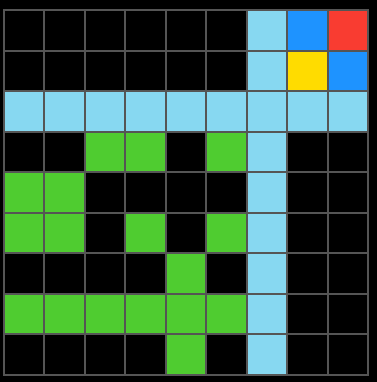
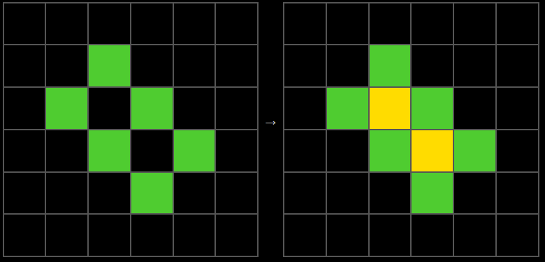
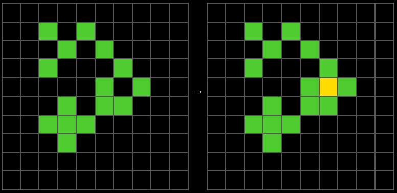
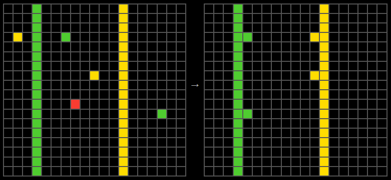
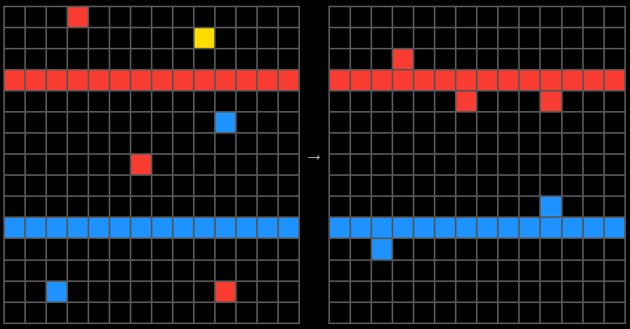
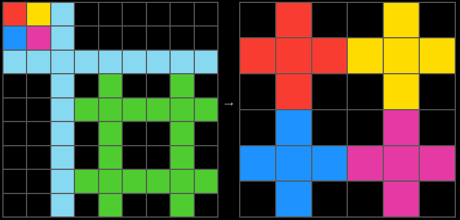
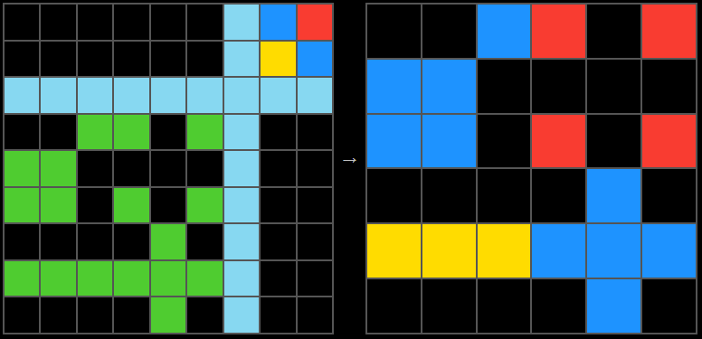

# arc_2024
This project is a solver for puzzles from the [ARC](https://github.com/fchollet/ARC-AGI). The code was written to solve the tasks in the [2024 Kaggle competition](https://www.kaggle.com/competitions/arc-prize-2024). This particular solution uses Induction Logic Programming to construct definitions in First Order Logic using an implementation of the [FOIL algorithm](https://link.springer.com/content/pdf/10.1007/BF00117105.pdf). For more on these topics, check out Artificial Intelligence - A Modern Approach by Stuart Russell & Peter Norvig, 4th Edition with particular attention to Chapter 20 - Knowledge in Learning

Here are some other papers written around solving ARC tasks in a similar way
- [Relational Decomposition for Program Synthesis](https://arxiv.org/abs/2408.12212)
- [Program Synthesis using Inductive Logic Programming for the Abstraction and Reasoning Corpus](https://arxiv.org/abs/2405.06399)

## Table of Contents

- [Overview](#overview)
- [Examples](#examples)
- [Limitations](#limitations)
- [Installation](#installation)
- [Usage](#usage)
- [Development](#development)
- [Testing](#testing)
- [Contributing](#contributing)

---

## Overview
The code is best understood starting at [arc_2024/runner.py](arc_2024/runner.py). The function `run` is called from [arc_2024/main.py](arc_2024/main.py) if running locally or from the Jupyter Notebook [arc_2024/arcprize_2024.ipynb](arc_2024/arcprize_2024.ipynb) when running on Kaggle. The runner has three main parts of interest.

1. Using the `Interpreter` to generate `Shape` objects that are contained in the inputs of the ARC tasks. These shapes attempt to allow the solver to 'see' the problems as a human would. Later these shapes can be used to build background knowledge relating to a set of predicates used in FOIL. More on that later...
2. Using the `GridSizeSolver` to solve the output grid sizes for a certain task. This class constructs `Predicate` objects, a target `Literal` and background knowledge that is then fed to the FOIL algorithm.
3. Using the result of the `GridSizeSolver`, the `Solver` similarly constructs `Predicate` objects, a target `Literal` and background knowledge that is then fed to the FOIL algorithm. This time, the range of predicates is much larger in scope to handle the huge amount of variance seen in the ARC tasks. In fact the range of predicates here is too limited to solve the majority of ARC tasks but serves a good example as how this kind of approach can be used on a subset of tasks.

### Interpreter
The Interpreter, found in [arc_2024/representations/interpreter.py](arc_2024/representations/interpreter.py), finds shapes by two methods, `LOCAL_SEARCH` or `SEPARATOR`. 

- `LOCAL_SEARCH` method searches the grids for any connected colours. A connection is when a colour is connected horizontally, vertically, or diagonally. We consider shapes which are made up of only one colour as well as shapes of mixed colour.
- `SEPARATOR` method breaks up the grids, using lines, in to separate shapes. We do not, in these cases, require there to be connected colours. An example of one such task solved by this interpretation is [7c008303](https://arcprize.org/play?task=7c008303). You can see below, there is an input example where the bottom left green squares would all be considered to be in one shape. This is necessary for the solution to be found by FOIL. In `LOCAL_SEARCH` multiple shapes would be interpreted



The `Interpreter` takes as inputs the raw data from the tasks and outputs `Shape` objects found in [arc_2024/representations/shape.py](arc_2024/representations/shape.py). If you look at the `Shape` class it simply allows us to group areas of colour in to distinguishable units. This allows us to reason about these shapes in a human-like manner e.g is point i,j above a shape or is point i,j inside the shape and the same colour etc. These methods in the `Shape` class are used later to populate the background knowledge related to the predicates we will use when solving the task.

### FOIL
As mentioned above, the core algorithm used here is FOIL. The code can be found [arc_2024/inductive_logic_programming/FOIL.py](arc_2024/inductive_logic_programming/FOIL.py). Please refer to the texts mentioned above for an in depth understanding of how FOIL works. For a simple example which is mentioned in the [paper](https://link.springer.com/content/pdf/10.1007/BF00117105.pdf) you can see the test `test_FOIL_with_simple_example` in [arc_2024/tests/inductive_logic_programming/test_FOIL.py](arc_2024/tests/inductive_logic_programming/test_FOIL.py). Some brief points to note:

- This implementation of FOIL does not use Prolog. This was simply done to avoid the difficulty of trying to install Prolog on Kaggle. As the ARC competition required the Notebook to have no access to the internet, setting this up was not easy. Although, I am sure with more time would have been possible with the use of a Dataset containing the relevant files. All the necessary key elements of First Order Logic needed for FOIL were written purely in Python. Please see [arc_2024/inductive_logic_programming/first_order_logic.py](arc_2024/inductive_logic_programming/first_order_logic.py) for the definitions of `ArgType`, `Variable`, `Predicate`, `RuleBasedPredicate`, `Literal` and `Clause`
- This implementation does not support recursion
- This implementation does support negated literals however the implementation is sub optimal in terms of speed. Improvements could be made here
- This implementation does allow for a `Beam Search`, helping FOIL avoid missing globally optimal solutions due to the greedy search nature of FOIL

### GridSizeSolver and Solver
Both the `GridSizeSolver` found [arc_2024/grid_size_solver.py](arc_2024/grid_size_solver.py) and `Solver` found [arc_2024/solver.py](arc_2024/solver.py) prepare the relevant data / objects to pass to `FOIL`. I will talk through `Solver` from now on as it is just a more complex version of `GridSizeSolver`. `GridSizeSolver` simply solves the output grid size where `Solver` aims to solve the actual position of colours found within that output grid.

- Looking at the `solve` function we can see how we prepare the data for FOIL
  - `_create_args_types` generates our `ArgType`s that we will used in our `Predicate`s. `ArgType`s can take a list of possible values or a `func` that will be evaluated using the example data. The `func` allows us to have specific sets of values for a particular example. For example our `i_arg` will only have i values from 0 to the respective grid height when extending the examples in FOIL.
  - `_create_variables` uses the `ArgType`s to create our initial `Variable`s which will be added to our target literal. We start with four variables `V1`, `V2`, `V3` and `V4` which are example number, colour, i, j in the output grids respectively. Further variables are added while we extend our examples when new predicates are added to the `Clause` during the running of FOIL
  - `_create_target_literal` creates `output(V1, V2, V3, V4).` as our target `Literal`
  - `_create_predicates` creates our `Predicate`s. This is a long function but simply sets up the `Predicate`s used in `FOIL`. The full list of `Predicate`s used can most easily be seen in the named tuple at the top of the file called `Predicates`. If a `Predicate` is a standard predicate then we populate the background knowledge related to this predicate in a subsequent function. If it's a `RuleBasedPredicate` then no background knowledge is generated but an evaluation function is defined. This function is simply invoked using the example data when assessing the predicate during the FOIL run
  - `_create_examples` creates the positive and negative examples to be passed to FOIL
  - `_create_background_knowledge` creates the background knowledge for all the standard `Predicate`s mentioned above
  - Finally FOIL is run with the above data

## Examples

### Task 00d62c1b
- Task found here [00d62c1b](https://arcprize.org/play?task=00d62c1b)
- A couple of the input examples are shown below



FOIL generates the following set of rules:

```
output(V1, V2, V3, V4):- mask-overlapping(V1, V2, V3, V4, V5)
output(V1, V2, V3, V4):- inside-blank-space(V1, V3, V4, V5), colour-YELLOW(V2)
```

The first rule is simply stating that any shape in the input grid is found in the output grid. We can see the new variable `V5` has been introduced which in this case is a shape variable. The second rule states that any square inside the the blank space of a shape is yellow. These two rules cover all positive examples and no negative examples and hence FOIL completes with a correct solution.

### Task 1a07d186
- Task found here [1a07d186](https://arcprize.org/play?task=1a07d186)
- A couple of the input examples are shown below



```
output(V1, V2, V3, V4):- mask-overlapping(V1, V2, V3, V4, V6), shape-group-BIGGEST(V1, V6)
output(V1, V2, V3, V4):- mask-overlapping-gravity-to-shape(V1, V3, V4, V5, V6), shape-size-1(V1, V5), shape-colour(V1, V6, V2), shape-colour(V1, V5, V2)
```

The first rule says that anything in a shape where that shape is the biggest shape in the input is found in the output. The second rule uses a predicate called mask-overlapping-gravity-to-shape/5 which is true if output is in shape V5 but has moved to touch V6. The rule then states that V5 must be a shape of size 1. Lastly the rule states that both shapes have the same colour. Again, these two rules cover all positive examples and no negative examples and hence FOIL completes with a correct solution.


### Task 7c008303
- Task found here [7c008303](https://arcprize.org/play?task=7c008303)
- A couple of the input examples are shown below



```
output(V1, V2, V3, V4):- mask-overlapping-expanded-to-grid(V1, V2, V3, V4, V5), mask-overlapping-moved-to-grid(V1, V6, V3, V4, V7)
```

In this case just one rule is found that covers all positive examples and no negative examples. The predicate mask-overlapping-expanded-to-grid/5 is true when a shape can be expanded to the output grid and the colours in the output grid are found in that expanded shape. As we can see in both examples this is true for only the small square shape in all examples. As there is only one shape in each input example that can be expanded to the output grid no further conditions on the shape V5 variable are needed. The second predicate mask-overlapping-moved-to-grid/5 is true when a shape can fit exactly in the output grid and the colours in the output grid are found in that shape. This again is only true for the large shape in all examples that matches the output grid size and hence no further conditions on V7 are needed. We can also see there is a free variable for colour, V6 introduced. This is not needed in the rule as the colour of the output is defined by the first predicate.

Other solved tasks can be seen by looking at the test `test_solver` in [arc_2024/tests/test_solver.py](arc_2024/tests/test_solver.py])

## Limitations
The Predicates used only allow us to solve a particular subset of tasks. Although the intention of these predicates was for them to remain relatively generic and hence reusable in other problems, the particular solution can not solve any of the private evaluation problems. The issue is that there are an enormous amount of ways that humans can interpret these shapes and hence find solutions to these abstract problems. The system, unlike a human, is not able to think on the spot to generate new ways of looking at a problem. This system is rigid in the way the `Interpreter` works as well as in what predicates it can use to formulate rules. Even if someone was able to generate a much larger set of predicates than are used here, the FOIL algorithm would become extremely slow as it would have to evaluate all these.

## Installation

To get started with this project, make sure you have [Poetry](https://python-poetry.org/docs/#installation) installed.

### Clone the Repository

```bash
git clone https://github.com/alexwernick/arc-2024
cd arc-2024
```

### Install Dependencies
```bash
poetry install
```

This command will create a virtual environment, if one doesn’t already exist, and install all dependencies specified in pyproject.toml.

## Usage
Run the application with:

```bash
poetry run python arc_2024/main.py
```

Alternatively, activate the virtual environment using:
```bash
poetry shell
```
Then, you can run the application or use other commands directly.

main.py will try and solve any tasks you have in arc_2024/data/temp/

## Development
To add or update dependencies, use Poetry’s dependency management commands:

- Add a Dependency: `poetry add <package-name>`
- Add a Development Dependency: `poetry add --dev <package-name>`

### Updating Dependencies
To update dependencies, you can run:

```bash
poetry update
```
This will update all dependencies to the latest versions within the constraints specified in `pyproject.toml`.

## Testing
This project uses `pytest` for testing. To run tests, execute:

```bash
poetry run pytest
```

Or, if you have activated the Poetry shell, just run:

```bash
pytest
```

## Contributing
Contributions are welcome! Please follow these steps:

1. Fork the repository.
2. Create a new branch for your feature or bugfix (git checkout -b feature-name).
3. Make your changes.
4. Commit your changes (git commit -am 'Add new feature').
5. Push to the branch (git push origin feature-name).
6. Create a pull request.

Please ensure that your code adheres to the coding standards (use the pre commit checks) and is well-documented.